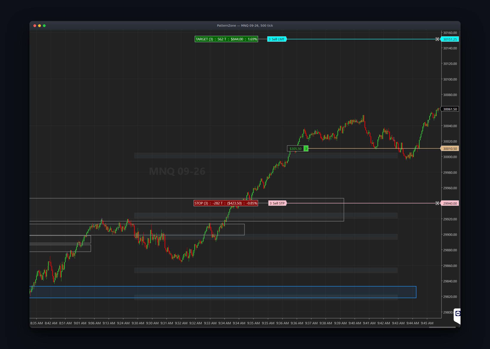
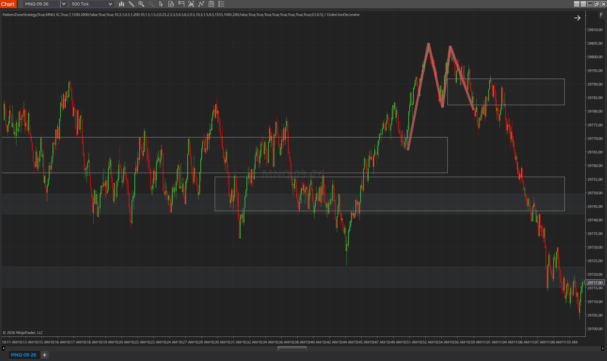
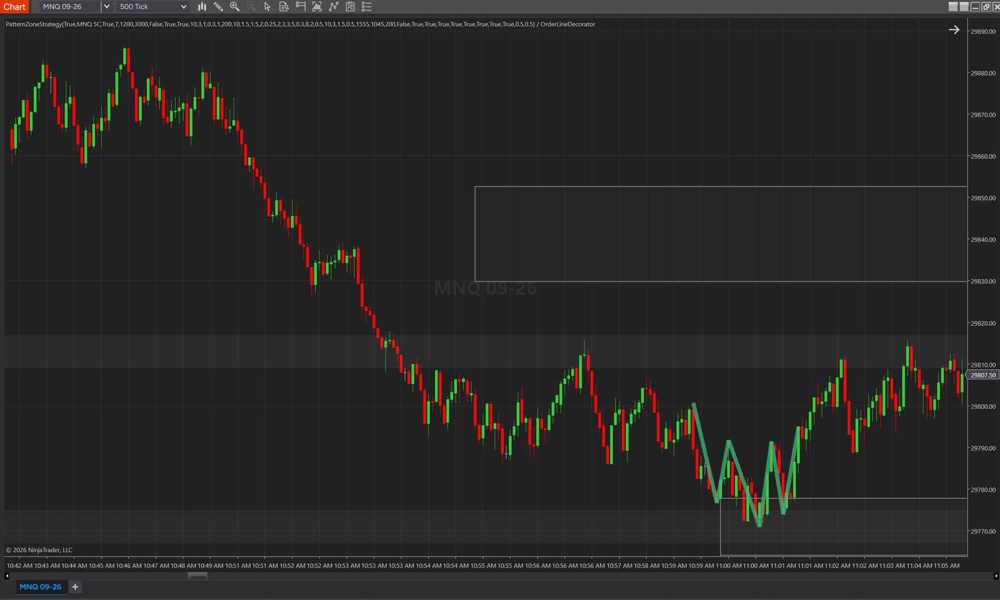
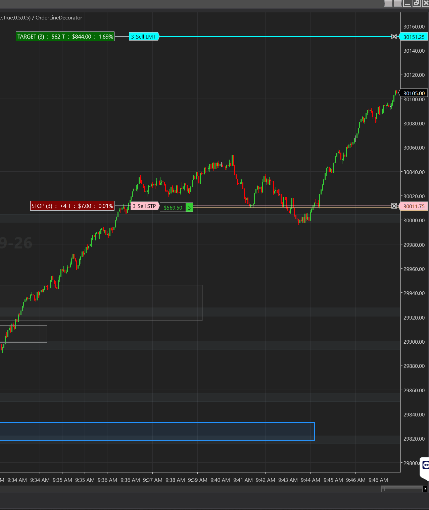
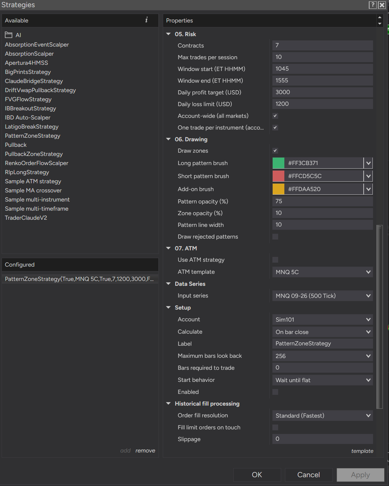
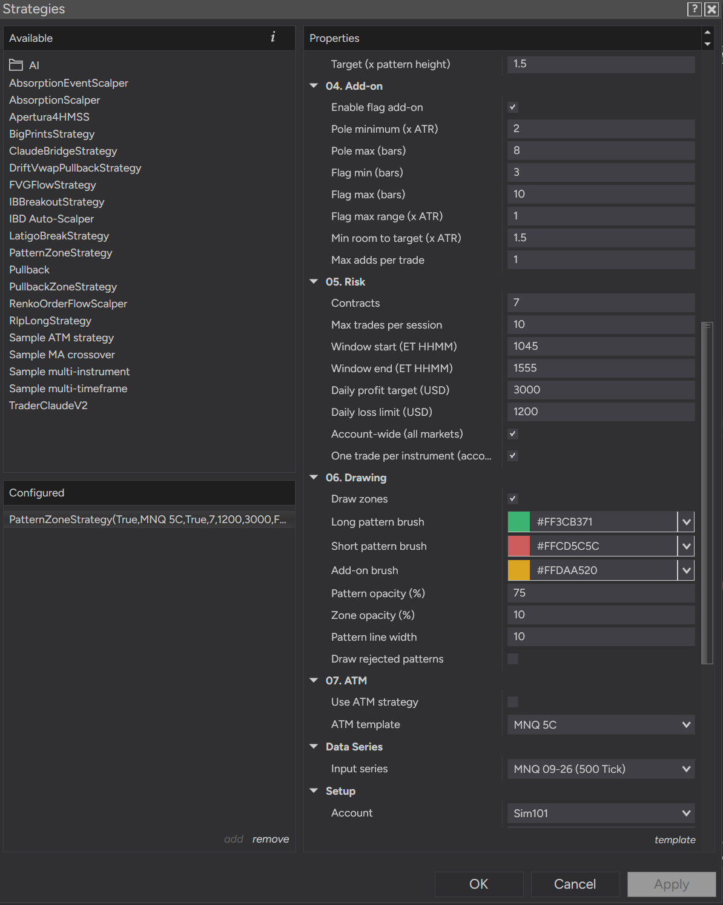

<div align="center">

<h1>PatternZone</h1>

<p>
  <b>A NinjaTrader 8 strategy that trades classic reversal chart patterns on MNQ — but only where the pattern forms on a long-memory support or resistance level.</b><br>
  Reversal patterns on their own are dead on NQ intraday; this workspace killed them four times. PatternZone exists to test the one version of the idea those studies left standing.
</p>

<p>
  <a href="#the-result">The result</a> ·
  <a href="#how-it-trades">How it trades</a> ·
  <a href="#reading-the-chart">Reading the chart</a> ·
  <a href="#settings">Settings</a> ·
  <a href="#install">Install</a> ·
  <a href="#limits">Limits</a>
</p>

<p>
  
  
  
  
  
  
</p>



<p><em>A long running on 500-tick MNQ under a single bracket: 3 contracts from 30,010.50, target at 30,151.25, stop at 29,940. The faint horizontal bands are the session levels, the blue box is a live intraday pivot zone, and the outlined boxes are zones price has already left behind.</em></p>

</div>

---

## The result

**There is no result yet, and no measured edge.** The strategy is built, compiles,
is deployed and passes 148 unit assertions — and not one validation phase has
finished. The captures on this page come from Phase 1, where the detector is being
*watched*, not measured. Nothing here is a claim about profitability.

| Stage | What it establishes | Status |
|---|---|---|
| Unit suite | The detection and decision core behaves as specified | **148 assertions, all passing** |
| 1 — Visual QA | The detector sees the patterns a human sees | **In progress** |
| 2 — Order-layer exercises | The order plumbing survives the events that break NT8 strategies | Pending |
| 3 — Frozen backtest | Whether there is anything here at all | Not run |
| 4 — Replay forward, ≥ 20–30 unseen sessions | **The only phase whose result qualifies real money** | Not run |

The protocol, its thresholds and its kill criteria were written down **before** any
P&L existed: [`docs/validation.md`](docs/validation.md). Phase 3 has to clear seven
pre-registered gates — average trade ≥ $5 net per contract, profit factor ≥ 1.3,
expectancy ≥ 0.10R, ≥ 100 trades, among others. If the strategy fails, the negative
result gets published here and the repo stays up.

```console
$ dotnet run --project tests
  ...
  ALL PASS
```

## The hypothesis

Classic reversal patterns — double and triple tops and bottoms, head and shoulders
— carry no edge on NQ intraday when taken on their own. That is not a suspicion; it
is the accumulated result of four falsified strategy families in this workspace: an
unconditioned price-pattern search across ~128 trials, a break-and-retest study
whose signal proved placebo-identical, a 15-minute trendline-retest class with
negative expectancy, and a pullback strategy archived at profit factor 1.06 with an
average trade the size of its commission. Patterns alone are a dead hypothesis and
this project does not revisit it.

What those studies did **not** kill was the level. The break-retest work found that
same-session pivots carry zero information, but it never tested **long-memory**
levels — prior-day high and low, the overnight range, the prior close, the day's
open, round hundreds — the prices thousands of participants can see and have been
looking at since yesterday.

So the hypothesis under test is narrow and falsifiable: **a reversal pattern is
worth trading only when its defining extremes sit on a long-memory level.** The
pattern supplies the trigger and the geometry; the level supplies the reason anyone
would defend that price. Take the level away and the design predicts its own
failure.

## How it trades

Detection runs on **confirmed swings only** and every decision is made on a **closed
bar** — no intrabar triggers, which is where the break-retest study found its
lookahead.

**Entry.** A pattern arms when its swings complete. It fires when a bar closes
beyond the neckline by at least 2 ticks; entry is at market on the next bar's open.
Top-family patterns go short, bottom-family long.



*Short entry — a **double top** on 500-tick MNQ, and the whole rule set in one
picture. Read off the capture: the two tops print at 29,805.5 and 29,804 (six ticks
apart, inside the tolerance), the trough between them sets the neckline at 29,782,
and the polyline's last leg ends at 29,781.5 — the close that broke it, exactly the
two ticks the trigger asks for. Pattern height ≈ 23.5 points, so the stop goes ten
ticks above the **second** top at ≈ 29,806.5 and the measured-move target (at the
1.5× multiple this chart was running) sits near 29,747: about 25 points of risk
against 35 of reward. Red is the short family, and at full opacity the polyline means
the pattern cleared every gate.*



*Long entry — the mirror image on a different session: three lows on the same shelf
(29,778, 29,772, 29,775), a neckline at 29,791 from the highs between them, and the
leg out ending at ≈ 29,795, through the neckline by more than the two-tick buffer.
Green is the long family. The lows sit on the top edge of the pivot-zone box drawn
under them — the level is what makes this shape tradeable at all.*

**A reversal needs something to reverse.** A pattern only qualifies if its first
defining extreme is the extreme of the trend-lookback window behind it — a double
top after an up-leg, a double bottom after a down-leg. Without that test the
strategy will happily short an M that formed halfway down a decline, which is not a
reversal at all; it did exactly that during the first visual QA, and this gate is
the fix.

**Permission — the thesis.** Before a fired pattern becomes a trade, its extremes
must sit inside one band around a level — the level ± 0.5 × ATR(14), plus another
0.5 × ATR of proximity allowance:

- Both tops of a double, at least 2 of 3 extremes of a triple, or the head of a
  head-and-shoulders.
- **Session and round levels:** prior-day high/low, overnight high/low, prior RTH
  close, day open, round 100s. Round 50s exist as a toggle and are **off** by
  default — on MNQ they fire often enough to make the permission close to no filter
  at all.
- **Intraday pivot zones:** levels built on a separate 5-minute series from pivots
  that price has touched and respected at least 3 times, each carrying its own band
  width, dying on a clean break and expiring after 2 calendar days. This class is
  the newest and the least trusted — it is kin to two dead 15-minute studies, so
  Phase 3 must be run twice, with it off and on, or its contribution is not
  attributable.
- The band **drawn** on the chart is the half-width only. Permission reaches the
  proximity allowance further, so an extreme can sit outside the painted band and
  still qualify. That gap is deliberate, not a rendering bug.

A pattern that fires away from every level is never traded. Turn on
`DrawRejectedPatterns` and those refusals are drawn at half opacity and print their
reason — `busy`, `session_cap`, `height`, `trend`, `zone`, `stop` or `instrument
busy` — to the Output window, since the chart deliberately carries no text. During
Phase 1 that switch belongs **on**: it is the only thing that tells a quiet session
apart from a broken one.

**Stop and target.** The stop sits 10 ticks beyond the pattern's **last defining
swing** — the second top or bottom, the third extreme of a triple, or the **right
shoulder** of a head-and-shoulders. Not the head: the head is what invalidates the
pattern while it is still forming, but the right shoulder is the level the breakdown
has to hold, and anchoring there makes an H&S stop materially tighter than the
geometry it targets. The target is the classic measured move — the pattern height
projected from the break point. Patterns shorter than 1.5 × ATR are rejected as
noise.



*The bracket, close up. One stop and one target cover the whole position, whatever
number of tranches built it — every contract exits at the same price. PatternZone's
own bracket is **fixed**: it moves only when a flag add-on resizes it. A stop sitting
at break-even like the one here has been advanced by an ATM template or by hand, not
by the strategy.*

Worth stating plainly: near the minimum pattern height this can risk more than it
makes, and **how much more depends on the ATR**, because the stop offset is a fixed
tick distance while the height is ATR-scaled. At ATR = 5 points a minimum-height
double is 0.75R (breakeven ≈ 57%); at ATR = 10 it is 0.86R (≈ 54%).
Head-and-shoulders is better on both counts — around 1.03R at ATR = 10 — because its
stop anchors the shoulder while its target is measured from the head. There is no
single R floor across the pattern families; the full table is in
[`docs/validation.md`](docs/validation.md).

**Adds — continuation patterns, never standalone.** While a position is open, a bull
or bear flag can add one tranche: a pole of ≥ 2 × ATR within 8 bars of the last fill,
then 3–10 bars consolidating inside 1 × ATR, then a close out of the flag in the
trade's favour. The aggregate stop moves up to the flag's far edge; **the target does
not move**. A flag detected with no open position does nothing at all.

**Risk.** One position at a time, flat to flat. Three base entries per session (adds
do not count). A realised daily loss of $200 flattens and locks out until the next
RTH open, and a daily profit target does the same on the winning side (off by
default). Forced flat at 15:55 ET.

**One trade per instrument, across robots.** With **One trade per instrument
(account)** ticked — the default — PatternZone will not open a position while the
account already holds one on that underlying, whether it belongs to another strategy
or to you. It is the two-robots case: sequential windows on the same instrument,
robot 1 still in its trade when robot 2's window opens, robot 2 stands aside until
the instrument is flat. It matches on the underlying, so a different contract month
counts as busy too.

**Shared daily limits across markets.** Tick **Account-wide (all markets)** and the
two daily limits stop measuring this chart and start measuring the **sum of every
PatternZone instance running on the account** — MNQ and NQ and anything else — so one
breach flattens and locks all of them out together. Honest scope: the sum is built
from those instances' own numbers, so it covers PatternZone and nothing else — not
LatigoBreak, not TBStrategy, not manual trades. Making it genuinely cross-strategy
needs those strategies publishing into the same shared record
(`PatternZoneShell.DailyGovernor`, public for exactly that reason); that is future
work. In this mode the total also counts **open** P&L, so a big loser is caught
before it closes.

## Reading the chart

The chart carries no text at all — every mark is geometry, so it shows *why* it
entered without becoming a dashboard.

| On the chart | What it is |
|---|---|
| Green polyline | A permitted **long** pattern — bottom family, including its lead-in and break legs |
| Red polyline | A permitted **short** pattern — top family |
| Half-opacity polyline | A **rejected** pattern (only with `DrawRejectedPatterns` on; the reason prints to Output) |
| Gold pole and two rails | A flag add-on at the bar it fired |
| Slate-gray band across the session | One of the six session levels: prior-day high/low, overnight high/low, prior close, day open |
| Blue box | A **live** intraday pivot zone under price — support |
| Orange-red box | A **live** intraday pivot zone above price — resistance |
| Faint outlined box | A **dead** pivot zone: cleanly broken or expired, kept on the chart as history |

Two things are deliberately absent. The **neckline** was drawn in the first build and
taken out after looking at it. And the **round-number levels** gate entries but are
never painted — the six session bands are the only levels drawn, so a pattern can be
permitted by a level that has no band under it.

Pivot boxes grow rightward from the bar the zone was born on until the bar it died,
which is why a healthy session ends up with a stack of outlined boxes behind price:
those are levels that worked until they didn't.

## Settings

The strategy dialog groups every dial by role: `01. Detection`, `02. Zones`,
`03. Entry`, `04. Add-on`, `05. Risk`, `06. Drawing`, `07. ATM`.



*Risk, Drawing and ATM. **These are Phase-1 working values, not the shipped
defaults** — 7 contracts (default 1), 10 trades per session (3), a 10:45–15:55
window (09:30–15:55), a $3,000 profit target (off) against a $1,200 loss limit
($200), and account-wide limits on (off). The drawing dials are pushed hard for
screen-reading: 75 % pattern opacity and line width 10 against the defaults of 65 and
4. Note the ATM group: a template can be picked from the dropdown — it lists what is
saved on this machine — and still do nothing at all until **Use ATM strategy** is
ticked, which it is not here.*



*The add-on group at its defaults — pole ≥ 2 × ATR within 8 bars, 3–10 flag bars
inside 1 × ATR, 1.5 × ATR of room left to the target, one add per trade — under a
target multiple raised to 1.5 pattern heights (default 1.0). Everything below
`04. Add-on` repeats the previous capture; the two together are the bottom half of
the properties list.*

**Statistical dials — frozen.** These were fixed before any P&L was seen. Changing
one is a pre-registered amendment that earns its own out-of-sample run, not a tweak.
Nine have been made so far — the last-swing stop rule, the zone proximity allowance,
the drawing cleanup, the prior-trend gate, the completed pattern legs, any-bar-type
session bookkeeping, optional ATM mode, the daily profit/loss limits with their
account-wide option, intraday pivot zones, and the one-trade-per-instrument guard —
all while no P&L existed, and all written up in
[`docs/design.md`](docs/design.md#amendments).

| Group | Parameters | Defaults |
|---|---|---|
| Detection | Swing strength · top tolerance · head prominence · max pattern span · neckline break · min pattern height · prior-trend gate · trend lookback | 3 · 0.30 ATR · 0.30 ATR · 60 bars · 2 ticks · 1.5 ATR · on · 60 bars |
| Zones | Zone half-width · zone proximity · six level toggles | 0.50 ATR · 0.50 ATR · all on except round 50s |
| Pivot zones | Enable · series · min touches · pivot K · half-width · clean break · expiry | on · 5 min · 3 touches · 3 bars · 0.30 ATR · 0.25 ATR · 2 days |
| Entry | Stop offset · stop buffer (add-on stop only) · target multiple | 10 ticks · 0.50 ATR · 1.0 × height |
| Add-on | Enable · pole min/max · flag min/max bars · flag max range · min room to target · max adds | on · 2.0 ATR / 8 bars · 3–10 bars · 1.0 ATR · 1.5 ATR · 1 |
| Risk | Contracts · max trades/session · window · daily loss limit · daily profit target · account-wide · one trade per instrument | 1 · 3 · 09:30–15:55 ET · $200 · off · off · on |
| ATM | Use ATM strategy · ATM template | off · (none) |

**Cosmetic dials — free.** Zone drawing, the three brushes, pattern and zone opacity,
pattern line width and rejected-pattern drawing can be changed at any time without
touching the pre-registration. The two opacity dials and the line width are
**deliberately excluded from the optimizer** — nothing about how the chart looks
should ever be searched over.

The ATR period (14) is not a parameter. It is pinned by the unit tests to cap degrees
of freedom.

## ATM mode

Optional. Tick **Use ATM strategy**, pick one of your NT8 ATM strategy templates from
the dropdown (the same list Chart Trader shows, read from
`Documents\NinjaTrader 8\templates\AtmStrategy`), and PatternZone hands each entry to
that template.

The template then **owns the trade**. It supplies the stop, the target **and the
position size**, so the stop offset, stop buffer, target multiple and `Contracts` all
do nothing; the flag add-on is disabled; and PatternZone's own bracket is never
submitted. What PatternZone still owns is which pattern trades at all, the
trading-window flatten, and the daily-loss lockout — the last one fed from the ATM's
own realized P&L, because NT8's `SystemPerformance` never books an ATM trade.

Two things it deliberately will not do. A missing or unknown template name stops
trading entirely rather than quietly reverting to the built-in bracket, since
choosing ATM was deliberate. And because NT8 ignores `AtmStrategyCreate` on historical
data, ATM mode takes **no trades in the Strategy Analyzer** — it is a realtime and
Playback feature, which is why [`docs/validation.md`](docs/validation.md) requires
Phase 3 to run with ATM off.

## Bar types

The strategy is **bar-type agnostic** — 1-minute, 30-second, 500-tick, volume or
range charts all work. Detection never referred to clock time, and the session
bookkeeping derives each bar's start from exact stamp arithmetic on time charts and
from the previous bar's close on tick, volume and range charts.

What does not transfer is the dials. Bar-count dials (trend lookback, max pattern
span, the pole and flag budgets) count **this chart's** bars, and the ATR-scaled dials
breathe with whatever range this chart's bars have. 60 bars of 500-tick MNQ is not 60
minutes.

So keep one **NT8 Strategy Template per bar type** — Save As `PZ-1m`, `PZ-500tick`,
`PZ-30s` — and let each carry its own dials. A faster chart generally wants the
bar-count dials **up**, since each bar covers less time. That is a suggestion and
**entirely unvalidated**: the frozen defaults were set on 1-Minute, and
[`docs/validation.md`](docs/validation.md) treats each bar-type variant as its own
strategy that has to earn its own evidence.

## Install

1. Copy **both** files to `Documents\NinjaTrader 8\bin\Custom\Strategies\`:
   - `ninjascript/PatternZoneStrategy.cs`
   - `ninjascript/PatternZoneCore.cs`

   Both go in `Strategies\`. NT8 compiles everything under `bin\Custom` into a single
   assembly, so the partner file simply belongs beside the strategy it serves —
   `PatternZoneCore.cs` declares its own `PatternZoneCore` namespace, so the usual
   "the namespace decides the folder" rule does not apply to it. That namespace is
   also deliberately free of any `NinjaTrader` reference, so the same file compiles
   inside NT8 and under the .NET 8 test runner.
2. Press **F5** in the NinjaScript Editor.
3. Apply `PatternZoneStrategy` to a chart meeting these requirements — each one fails
   silently rather than with an error:

| Requirement | Why |
|---|---|
| **MNQ**, front month | Costs, gates and the daily-loss default are at MNQ scale |
| A bar type you have a template for | 1-Minute is where the defaults were frozen; anything else needs its own dials |
| The instrument's **full ETH** session template | Overnight high/low are two of the six levels; an RTH-only template deletes them (the strategy logs a warning at the second session open) |
| NT8 time zone = **US Eastern** | Every `HHMM` parameter and the 09:30 / 16:00 / 18:00 boundaries are ET wall clock |
| Days to load = window **+ 2 days** | Prior-day levels come from the session before; the first loaded day has none |

The first trade is possible on the 15th bar (ATR warmup). Every state that prevents
trading — outside the window, locked out, never warmed up, instrument busy —
announces itself once per session to both the Log tab and the Output window, so a
silent day is diagnosable instead of ambiguous.

## Limits

- **No measured edge.** See [The result](#the-result). Do not run this on real money
  before Phase 4 of [`docs/validation.md`](docs/validation.md) passes.
- **v1 scope.** Wedges, pennants, cup-and-handle, diamonds, islands and rounding
  patterns are not implemented. Continuation patterns are add-only by design and will
  never open a position.
- **No PropSim mirror**, so there are no placebo or excursion controls. All the
  epistemic honesty this project has lives in the validation protocol: frozen
  defaults, out-of-sample only, forward replay as the gate, kill criteria written in
  advance.
- **No prop-firm envelope.** Sized for a personal account; the drawdown rules of
  funded accounts are not modelled.
- **Single instrument, single series.** Not tested on anything but MNQ.
- Not financial advice. Trading futures can lose more than you deposit.

## License

MIT — see [LICENSE](LICENSE).
